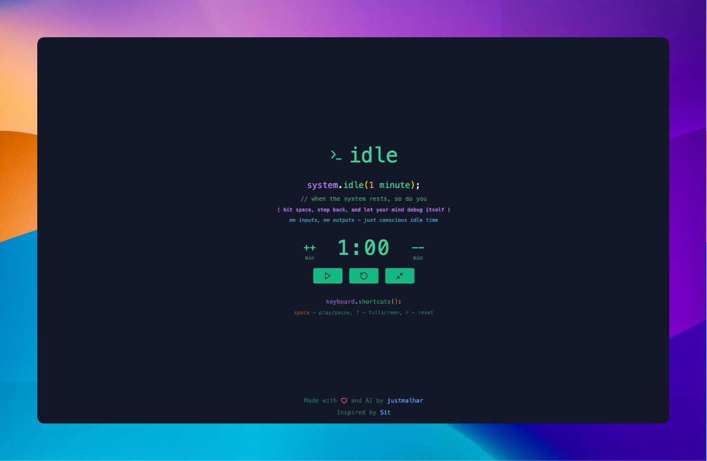

# Idle Time

> **system.idle(X minutes)**  
> *When the system rests, so do you.*
> ⟨ hit space, step back, and let your mind debug itself ⟩
>no inputs, no outputs - just conscious idle time 

Idle Time is a brutally simple mindfulness timer designed for developers. Take a moment to pause, breathe, and reflect—all without leaving your workspace. It's distraction-free, keyboard-friendly, and intentionally minimal.

---

## Demo



---

## Features

- **Customizable Timer**: Increase or decrease timer duration with intuitive controls.
- **Keyboard Shortcuts**:  
  - `space` - play/pause  
  - `f` - toggle fullscreen  
  - `r` - reset the timer  
- **Developer-Themed Design**: Built with a console-inspired aesthetic that speaks your language.  

---

## Live Demo

🚀 **[Try Idle now](https://idletimer.vercel.app)**

---

## Installation

To run this project locally:

1. Clone the repository:

    ```bash
    git clone https://github.com/your-username/idle-timer.git
    ```

2. Navigate to the project directory:

    ```bash
    cd idle-timer
    ```

3. Install dependencies:

    ```bash
    npm install
    ```

4. Start the development server:

    ```bash
    npm start
    ```

## Keyboard Shortcuts

| Key | Action |
|-----|--------|
| space | Play/Pause Timer |
| f | Toggle Fullscreen |
| r | Reset Timer |


## Contributing

Contributions are welcome! If you have ideas for new features or improvements, please open an issue or submit a pull request.

## License

This project is licensed under the MIT License. See the LICENSE file for details.

## Acknowledgments

Inspired by [Sit.Sonnet.io](https://sit.sonnet.io/)

Built with ❤️ and AI by [Malhar Ujawane](https://x.com/justmalhar). Developed due to the need for a pause and reset in a busy world. 

Follow me on:
- [X](https://x.com/justmalhar)
- [GitHub](https://github.com/justmalhar)
- [LinkedIn](https://www.linkedin.com/in/justmalhar/)

---